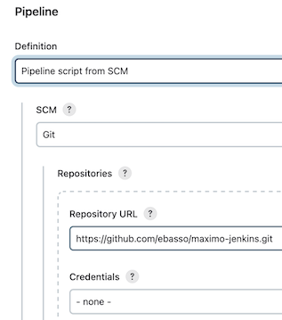
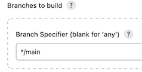

# maximo-jenkins
Working with Maximo and Jenkins

## Create pipeline in Jenkins that:

1) Checkout your source code from this repository
2) Use the steps in Jenksfile

## In **Jenkinsfile** will do:

1) Compile: Creates the target directory, lists all Java files recursively, saves the list to sources.txt, and then compiles all Java files listed in sources.txt into the target directory.
2) Zip: Zips the contents of the target directory into a file named customization_binaries.zip.
3) Post-build: Displays a message indicating whether the build succeeded or failed.
